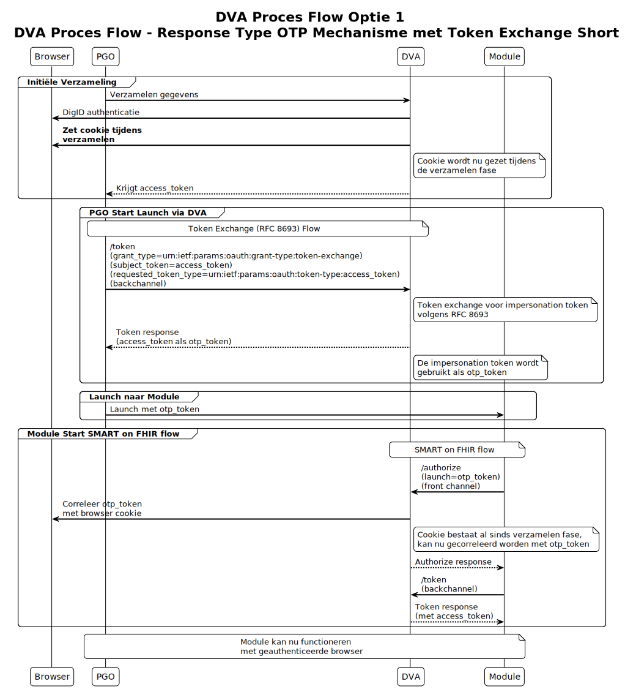
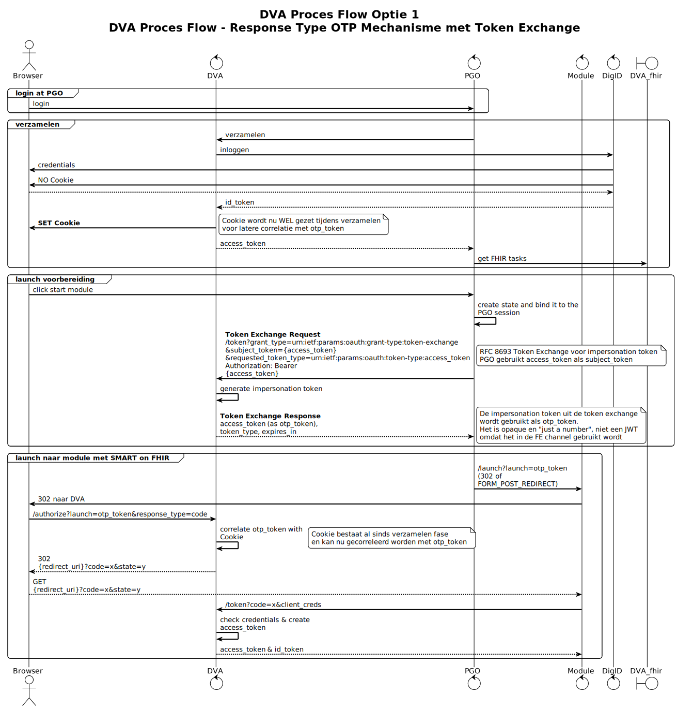

# Optie 1: Cookie op het DVA domein

**Het nieuwe inzicht is dat browser authenticatie niet gekoppeld hoeft te worden aan een gebruiker login of Identity Provider sessie.** We zetten een cookie enkel en alleen om het OTP bij uitgifte te correleren aan de browser tijdens de validatie. **Door de cookie al tijdens de verzamelen fase te zetten en vervolgens Token Exchange (RFC 8693) te gebruiken voor OTP-token uitgifte, elimineren we de noodzaak om opnieuw te moeten inloggen bij het starten van de module.**

Deze optie beschrijft de werking van het DVA (Dienstverlener Aanbieder) proces waarbij **een cookie wordt gezet tijdens de verzamelen fase en Token Exchange wordt gebruikt voor OTP-token uitgifte**. De cookie is niet gekoppeld aan de DigID login of gebruikersidentiteit, maar dient uitsluitend voor browser correlatie met het otp_token. Op hoog niveau:

* Het PGO doet het verzamelen en krijgt een access_token
  * **DVA zet tijdens deze fase al een cookie in de browser**
* Het PGO wil een launch starten en **gebruikt Token Exchange (RFC 8693) bij de DVA**
  * **PGO doet een backchannel Token Exchange request met het bestaande access_token als subject_token**
  * **DVA genereert een impersonation token die gebruikt wordt als otp_token**
  * **Geen browser interactie meer nodig - pure backchannel operatie**
* De PGO doet een launch met het otp_token
* De module ontvangt een launch en start een OIDC of SMART on FHIR flow
  * **Het otp_token wordt gecorreleerd met de cookie die al tijdens verzamelen is gezet**
  * Bij de /token stap wordt het access_token via de backchannel verkregen en met de bestaande client_credentials opgehaald.

Hoofdstappen van het proces
1. Initiële PGO login
   De gebruiker logt in bij zijn Persoonlijke Gezondheidsomgeving (PGO)
   PGO maakt een sessie-status aan en bindt deze aan de PGO-sessie
   Dit vormt het startpunt voor toegang tot digitale interventies

2. Verzamelen van gegevens
   PGO vraagt DVA (Dienstverlener Aanbieder) om gegevens te verzamelen
   DVA laat gebruiker inloggen via DigID voor authenticatie
   Na succesvolle authenticatie krijgt DVA toegang en geeft een access_token terug aan PGO
   **DVA zet tijdens dit proces een cookie voor latere correlatie met OTP-token**
   PGO gebruikt dit token om FHIR-taken op te halen van DVA
   Opmerking: Dit is een OIDC (OpenID Connect) flow

3. Voorbereiding voor module launch
   Gebruiker klikt op "start module" in PGO
   **PGO voert een Token Exchange (RFC 8693) uit met DVA om een impersonation token te verkrijgen**
   **PGO stuurt een backchannel request naar DVA met:**
- **grant_type=urn:ietf:params:oauth:grant-type:token-exchange**
- **subject_token=access_token (uit stap 2)**
- **requested_token_type=urn:ietf:params:oauth:token-type:access_token**
  **DVA genereert een impersonation token die gebruikt wordt als OTP-token**
  Opmerking: Het OTP-token blijft een opaque waarde ("gewoon een nummer") en geen JWT, omdat het gebruikt wordt in het frontend-kanaal
  **Opmerking: Dit is nu een Token Exchange flow volgens RFC 8693 in plaats van OIDC**

4. Daadwerkelijke launch naar module
   PGO stuurt gebruiker door naar de module met het OTP-token (via 302 redirect of FORM_POST_REDIRECT)
   Module stuurt gebruiker terug naar DVA voor finale autorisatie
   **DVA correleert het OTP-token met de cookie die gezet werd tijdens stap 2**
   DVA genereert finale toegangstokens en stuurt gebruiker terug naar module
   Module krijgt uiteindelijk een access_token en id_token om te kunnen functioneren

